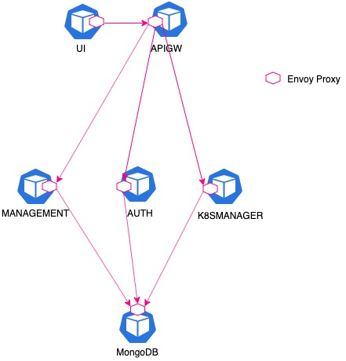

# ocp-lab-istio-files

Istio files used to set the network pollicies for the OCP-Lab microservice app published in Medium. The architevture that implements these policies is:

# ocp-lab-istio-files
# ocp-lab-istio-files
